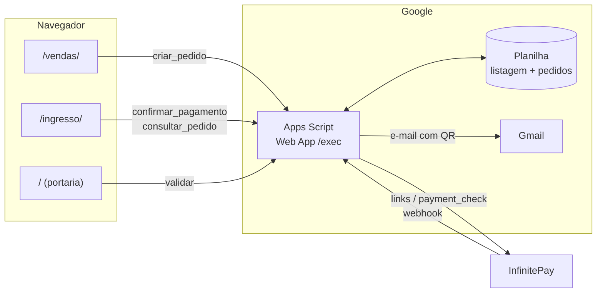
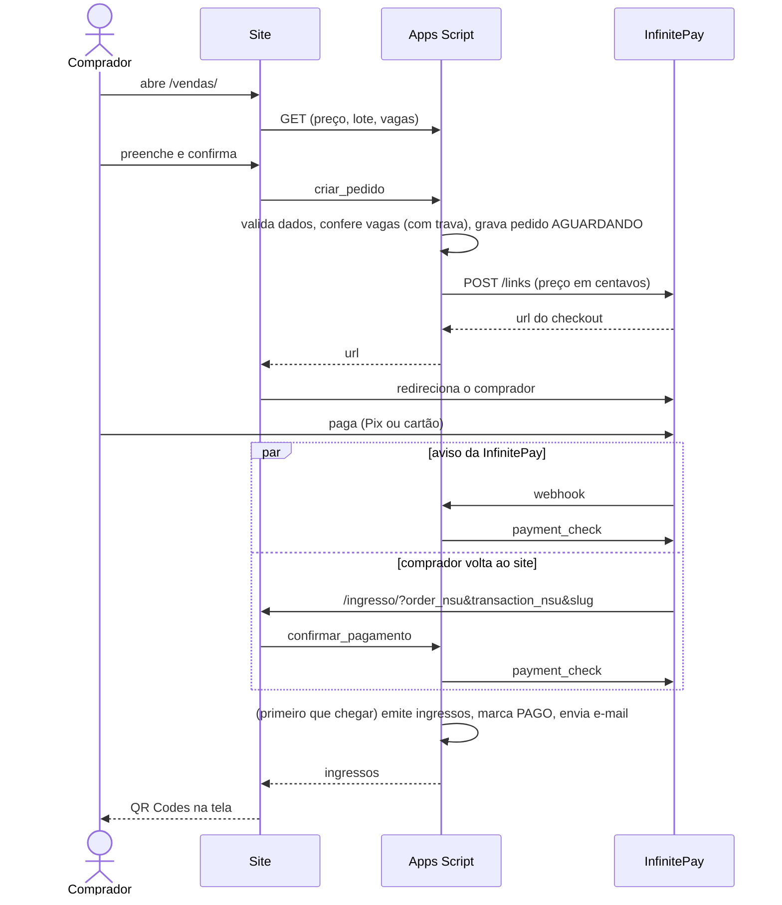
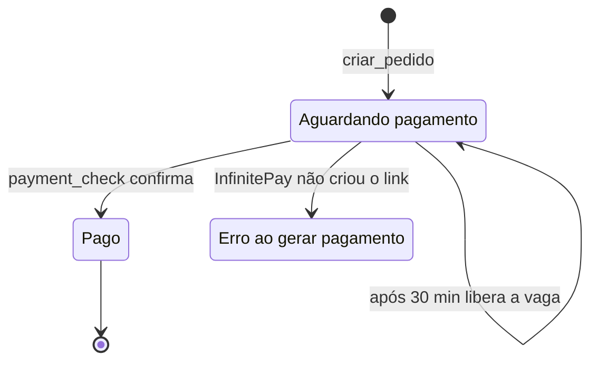
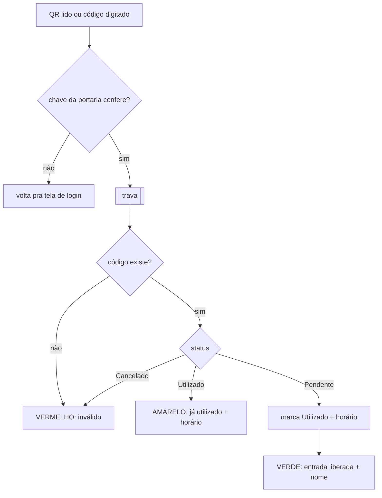
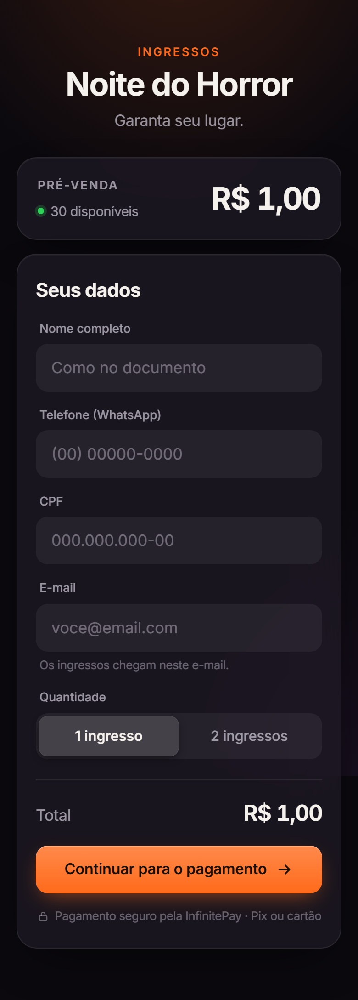
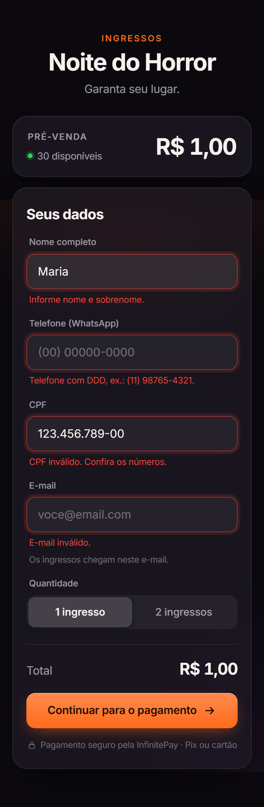
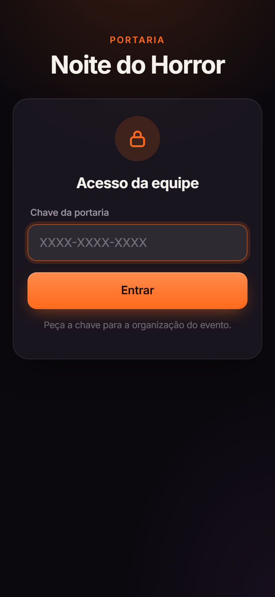

# Relatório de entrega: sistema de ingressos da Noite do Horror

Este documento explica tudo o que mudou no sistema, por que mudou, e o que
você precisa fazer no Apps Script, na InfinitePay e no GitHub para colocar a
versão nova no ar. Ele foi escrito para ser lido do começo ao fim uma vez e
depois consultado por partes.

O [README.md](README.md) é a referência rápida do dia a dia. Este aqui é o
relatório completo.

---

## Sumário

1. [Resumo em uma página](#1-resumo-em-uma-página)
2. [O que encontramos no código original](#2-o-que-encontramos-no-código-original)
3. [Como o sistema funciona agora](#3-como-o-sistema-funciona-agora)
4. [A nova interface](#4-a-nova-interface)
5. [Testes: como sabemos que funciona](#5-testes-como-sabemos-que-funciona)
6. [Passo a passo para colocar no ar](#6-passo-a-passo-para-colocar-no-ar)
7. [No dia do evento](#7-no-dia-do-evento)
8. [Tarefas do dia a dia](#8-tarefas-do-dia-a-dia)
9. [Solução de problemas](#9-solução-de-problemas)
10. [Limitações e próximos passos](#10-limitações-e-próximos-passos)
11. [Referência técnica](#11-referência-técnica)
12. [Glossário](#12-glossário)

---

## 1. Resumo em uma página

### Como estava

O sistema já tinha a parte mais trabalhosa resolvida: a integração com o
checkout da InfinitePay estava funcionando e a planilha recebia os ingressos.
Mas, olhando com calma, havia problemas que iam aparecer no meio da festa:

| # | Problema | Gravidade |
|---|---|---|
| 1 | Dava pra gerar ingresso **sem pagar**, mandando um webhook falso | Crítica |
| 2 | O comprador pagava e **não recebia o ingresso** (nem tela, nem e-mail) | Crítica |
| 3 | A página mostrava **R$ 1,00** e o sistema cobrava **R$ 2,00** | Alta |
| 4 | Qualquer pessoa com o link da portaria podia **"queimar" ingressos** dos outros | Alta |
| 5 | Não havia **limite de vendas**: "30 disponíveis" era só um texto fixo | Alta |
| 6 | Um nome digitado como fórmula (`=...`) **virava fórmula** na planilha | Média |
| 7 | Pedidos guardados num lugar com **limite de 500 KB** | Média |
| 8 | Erros internos apareciam pro usuário; coluna `id` nunca era preenchida; biblioteca de QR sem versão fixa | Baixa |

### Como ficou

- **Pagamento verificado direto na InfinitePay.** O webhook não é mais
  aceito como prova de pagamento.
- **O comprador recebe o ingresso de dois jeitos:** numa página com o QR Code
  logo depois de pagar, e por e-mail.
- **Preço, lote e vagas vêm do backend.** O site não tem mais nenhum valor
  fixo no código.
- **A portaria exige uma chave**, e o mesmo QR nunca passa duas vezes, nem
  com dois celulares lendo ao mesmo tempo.
- **Interface nova**, no estilo dos apps da Apple, sem emojis, com animações.
- **93 testes automáticos**, incluindo os cenários de ataque.

### O que você precisa fazer (uns 30 minutos)

1. Fazer backup da planilha e do script atual ([6.1](#61-antes-de-começar-backup)).
2. Colar os arquivos novos no Apps Script ([6.2](#62-apps-script)).
3. Rodar `configurarSistema()` e anotar a chave da portaria.
4. Publicar uma **nova versão na implantação existente**.
5. Publicar o site no GitHub Pages ([6.4](#64-github-pages)).
6. Fazer uma compra real de R$ 1,00 e validar o ingresso ([6.5](#65-teste-de-aceitação-com-dinheiro-de-verdade)).
7. Ajustar o preço real e publicar de novo ([6.6](#66-colocando-o-preço-de-verdade)).

---

## 2. O que encontramos no código original

Cada item abaixo tem: o que acontecia, por que isso é um problema, e o que
foi feito.

### 2.1 Webhook falsificável: ingresso de graça (crítico)

**O que acontecia.** O `doPost` recebia o aviso de pagamento da InfinitePay
(o webhook), conferia se o campo `amount` batia com o valor do pedido e, se
batesse, gerava os ingressos.

**Por que é um problema.** A própria documentação da InfinitePay mostra que o
webhook **não tem assinatura**. Não existe nenhum jeito de saber se quem
mandou aquele JSON foi a InfinitePay ou outra pessoa. E a URL do Apps Script
não é secreta: ela aparece no código-fonte da página de vendas, que qualquer
um abre com F12.

Então bastava alguém:

1. abrir o checkout pra criar um pedido (sem pagar);
2. pegar o `order_nsu` desse pedido;
3. mandar pro Apps Script um JSON com esse `order_nsu`, um `transaction_nsu`
   e um `invoice_slug` inventados, e o `amount` certo.

O script acreditava e emitia o ingresso.

**O que fizemos.** O webhook virou só um "aviso". Quando ele chega, o
backend pergunta diretamente à InfinitePay, pelo endpoint oficial
`payment_check`, se aquela transação foi paga e por quanto. Só se a
InfinitePay responder `paid: true` com o valor certo o ingresso é emitido. O
valor que vem no webhook é ignorado.

**Antes** (trecho do `processarWebhook` original). Os valores `amount` e
`paidAmount` vinham do próprio corpo do webhook, ou seja, de quem mandou:

```js
const amount = Number(dados.amount || 0);          // veio da requisição
const paidAmount = Number(dados.paid_amount || 0); // veio da requisição

if (amount !== valorEsperado) {
  return respostaWebhookErro('Valor do pedido não confere.');
}
if (paidAmount <= 0) {
  return respostaWebhookErro('Pagamento não confirmado.');
}

// AGORA SIM: cria os ingressos.
const ingressos = criarIngressos(pedido);
```

**Depois** (`Pagamentos.gs`). Quem responde se está pago é a InfinitePay,
consultada pelo próprio backend:

```js
function consultarPagamento_(orderNsu, transactionNsu, slug) {
  const resposta = chamarInfinitePay_(CONFIG.INFINITEPAY.URL_CONSULTAR_PAGAMENTO, {
    handle: CONFIG.INFINITEPAY.HANDLE,
    order_nsu: orderNsu,
    transaction_nsu: transactionNsu,
    slug: slug,
  });

  return {
    // Comparação estrita: só `true` de verdade conta. "true" em string,
    // 1 ou qualquer outra coisa estranha é tratada como não pago.
    pago: resposta.success === true && resposta.paid === true,
    valorCentavos: Number(resposta.amount) || 0,
    valorPagoCentavos: Number(resposta.paid_amount) || 0,
    metodo: String(resposta.capture_method || ''),
  };
}
```

E em `Pedidos.gs`, a confirmação usa só a resposta da InfinitePay e emite os
ingressos dentro de uma trava, relendo o pedido pra não emitir duas vezes:

```js
if (!pagamento.pago) {
  throw new ErroNegocio('PAGAMENTO_PENDENTE', 'Pagamento ainda não confirmado.');
}

// amount = valor do pedido; paid_amount pode ser maior (juros do
// parcelamento ficam por conta do cliente), mas nunca menor.
if (pagamento.valorCentavos !== pedido.valorCentavos ||
    pagamento.valorPagoCentavos < pedido.valorCentavos) {
  throw new ErroNegocio('VALOR_DIVERGENTE',
    'O valor pago não confere com o pedido. Procure a organização.');
}

const pago = comTrava_(function () {
  // Relê dentro da trava: o webhook pode ter terminado enquanto
  // a gente esperava a resposta do payment_check.
  const atual = buscarPedido_(orderNsu);
  if (atual.status === STATUS_PEDIDO.PAGO) {
    return Object.assign(atual, { ingressos: listarIngressosDoPedido_(orderNsu) });
  }

  const ingressos = emitirIngressos_(atual);
  // ... marca o pedido como PAGO na planilha
});
```

Você já tinha começado esse caminho: a função `consultarPagamentoTeste()` no
fim do script antigo chamava exatamente esse endpoint. Ela virou a base da
verificação.

> Arquivos: `apps-script/Pagamentos.gs` (`consultarPagamento_`) e
> `apps-script/Pedidos.gs` (`confirmarPagamento_`).

### 2.2 O comprador não recebia o ingresso (crítico)

**O que acontecia.** Depois de pagar, a InfinitePay mandava o cliente pra
`redirect_url`, que apontava pra `/vendas/`, ou seja, de volta pro
formulário de compra. Os ingressos eram criados na planilha, mas nada era
mostrado nem enviado ao comprador. Ele pagava e ficava sem nada na mão.

**O que fizemos.**

- **Página nova `/ingresso/`.** A InfinitePay agora devolve o cliente pra lá,
  com `order_nsu`, `transaction_nsu` e `slug` na URL. A página pede ao
  backend pra confirmar o pagamento e mostra os ingressos, cada um com seu QR
  Code, no formato de um passe da Apple Wallet.
- **E-mail automático** com os QR Codes e um link permanente pra página de
  ingressos.
- **Link permanente.** Depois de confirmar, a URL da página é trocada por
  `/ingresso/?pedido=...&token=...`. O cliente pode favoritar ou abrir de novo
  pelo e-mail. O `token` é um código aleatório de 32 caracteres, impossível
  de adivinhar.

Um detalhe importante: **o retorno do cliente e o webhook fazem a mesma
coisa.** O que chegar primeiro emite os ingressos e o outro só lê o
resultado. Se o webhook atrasar ou falhar (acontece), o cliente que voltou
pro site recebe o ingresso do mesmo jeito.

### 2.3 Preço errado

**O que acontecia.** A página mostrava `R$ 1,00` (constante `PRECO = 1` no
HTML) e o script mandava `PRECO_INGRESSO = 200` pra InfinitePay. A
documentação é clara: **o preço vai em centavos**. `200` = R$ 2,00.

**O que fizemos.** O preço existe num lugar só: `PRECO_CENTAVOS` no
`apps-script/Config.gs`. O site lê esse valor do backend ao abrir. Não tem
mais como os dois ficarem diferentes.

### 2.4 Portaria sem senha

**O que acontecia.** O validador chamava um Apps Script (outro projeto, com
URL `AKfycby15Iu1...`) passando só o código do ingresso. Qualquer pessoa que
abrisse o validador, ou chamasse a URL direto, podia:

- marcar o ingresso de outra pessoa como "Utilizado" antes dela chegar;
- testar códigos até achar um válido.

Além disso, a comunicação era por JSONP (uma técnica antiga que injeta um
`<script>` na página). JSONP funciona, mas é frágil e, se o servidor for
comprometido, ele consegue executar qualquer código na página.

**O que fizemos.**

- **Chave da portaria.** Gerada pelo `configurarSistema()`, no formato
  `XXXX-XXXX-XXXX`, guardada nas Propriedades do Script (fora do código). O
  validador pede a chave uma vez e o aparelho lembra.
- **Trava contra entrada dupla.** Conferir e marcar como "Utilizado"
  acontecem dentro de uma trava (`LockService`). Se dois celulares lerem o
  mesmo QR no mesmo instante (alguém mandou print pro amigo), só um recebe
  "Entrada liberada".
- **Validação no mesmo backend das vendas.** O segundo projeto de Apps Script
  não é mais necessário.
- **`fetch` no lugar de JSONP.** Mais simples, sem injetar scripts.

Como ficou a validação (`Ingressos.gs`). A chave é conferida antes de tudo,
e "conferir o status" e "marcar como utilizado" acontecem juntos, dentro da
trava:

```js
function validarIngresso_(codigoInformado, chave) {
  exigirChavePortaria_(chave);

  const codigo = normalizarCodigo_(codigoInformado);
  if (!codigo) {
    throw new ErroNegocio('DADOS_INVALIDOS', 'Informe o código do ingresso.');
  }

  return comTrava_(function () {
    const ingresso = lerIngressos_().filter(function (i) { return i.codigo === codigo; })[0];

    if (!ingresso) {
      return { resultado: 'invalido', mensagem: 'Código não encontrado.' };
    }
    if (ingresso.status === STATUS_INGRESSO.CANCELADO) {
      return { resultado: 'invalido', nome: ingresso.nome, mensagem: 'Ingresso cancelado.' };
    }
    if (ingresso.status === STATUS_INGRESSO.UTILIZADO) {
      return { resultado: 'utilizado', nome: ingresso.nome, utilizadoEm: /* ... */ };
    }

    const aba = obterAba_(CONFIG.ABA_INGRESSOS);
    aba.getRange(ingresso.linha, COL_INGRESSO.STATUS).setValue(STATUS_INGRESSO.UTILIZADO);
    aba.getRange(ingresso.linha, COL_INGRESSO.UTILIZADO_EM).setValue(new Date());
    SpreadsheetApp.flush();

    return { resultado: 'valido', nome: ingresso.nome };
  });
}
```

### 2.5 Sem limite de vendas

**O que acontecia.** "30 ingressos disponíveis" era texto fixo no HTML. Nada
impedia vender o 31º, o 50º, o 100º.

**O que fizemos.** O backend conta:

- ingressos já emitidos (não cancelados) na aba `listagem`, inclusive
  cortesias lançadas à mão;
- **mais** os pedidos que ainda estão no checkout, criados nos últimos 30
  minutos (a "reserva").

Sem a reserva, 30 pessoas abrindo o checkout ao mesmo tempo poderiam pagar
por 60 ingressos. Se o checkout não é concluído em 30 minutos, a vaga volta.

A conta inteira cabe numa função (`Pedidos.gs`):

```js
function calcularVagas_() {
  const limiteReserva = Date.now() - CONFIG.RESERVA_MINUTOS * 60 * 1000;

  const reservados = lerPedidos_()
    .filter(function (p) {
      return p.status === STATUS_PEDIDO.AGUARDANDO &&
        p.criadoEm instanceof Date &&
        p.criadoEm.getTime() >= limiteReserva;
    })
    .reduce(function (soma, p) { return soma + p.quantidade; }, 0);

  return Math.max(0, CONFIG.CAPACIDADE - contarIngressosAtivos_() - reservados);
}
```

Ela é chamada dentro da trava, junto com a gravação do pedido. Sem isso,
duas pessoas poderiam ver "1 vaga" ao mesmo tempo e as duas comprarem.

A página mostra quantas vagas restam, fica com a bolinha laranja pulsando
quando sobram 5 ou menos e troca pra "Esgotado" quando acaba.

### 2.6 Injeção de fórmula na planilha

**O que acontecia.** `setValue` grava texto que começa com `=` como
**fórmula**. Um "nome" como `=IMPORTXML("http://site.com"; "//a")` seria
executado na planilha, que tem CPF e telefone de todo mundo.

Do mesmo jeito, o Sheets converte sozinho texto que parece número: um código
como `2E512345` vira número em notação científica, e um telefone pode perder o
zero da frente.

**O que fizemos.** Todo texto gravado recebe um apóstrofo invisível na frente
(`'`), que força o Sheets a tratar como texto puro. O apóstrofo não aparece na
célula. A única fórmula gravada de propósito é a do QR Code (`=IMAGE(...)`).

```js
// Antes: o texto ia direto pra célula
aba.getRange(linha, 2).setValue(pedido.nome);

// Agora (Planilha.gs): todo texto passa por aqui antes de ser gravado
function textoSeguro_(valor) {
  if (valor === null || valor === undefined) return '';
  if (typeof valor !== 'string') return valor;
  if (valor === '') return '';
  return "'" + valor;
}
```

### 2.7 PropertiesService usado como banco de dados

**O que acontecia.** Cada pedido era salvo como uma propriedade do script
(`PEDIDO_...`, `PAGO_...`), além de `ULTIMO_WEBHOOK` e outras de diagnóstico.

**Por que é um problema.** O PropertiesService tem limite de **500 KB no
total** e 9 KB por valor. Com algumas centenas de pedidos, ele enche e o
sistema para de aceitar compras. Também não dá pra ver nem editar esses
dados com facilidade, e o `ULTIMO_WEBHOOK` ficava guardando dados de cliente
sem necessidade.

**O que fizemos.** Os pedidos agora ficam na aba nova **`pedidos`** da
planilha, uma linha por compra, visível e editável. As propriedades guardam só
a chave da portaria. O diagnóstico agora vai pro log de execuções do Apps
Script (seção [9](#9-solução-de-problemas)).

### 2.8 Problemas menores

| O que era | O que virou |
|---|---|
| Código do ingresso sorteado com `Math.random()`, que não é imprevisível | Sorteio com `Utilities.getUuid()`, que usa gerador criptográfico. Código de 8 caracteres (antes 6), ~1 trilhão de combinações |
| A coluna inteira de códigos era relida a cada código sorteado | Lida uma vez e checada em memória |
| Cada ingresso gravava 8 células, uma por vez | Uma gravação em lote por pedido |
| Coluna `id` nunca era preenchida (o UUID era gerado e descartado) | Preenchida |
| Mensagens de erro internas iam direto pro usuário | O usuário vê uma mensagem amigável; o detalhe vai pro log |
| `html5-qrcode` carregado do unpkg **sem versão** (qualquer atualização da biblioteca entraria no ar sem aviso) | Versão fixa 2.3.8 do cdnjs, com verificação de integridade (SRI) |
| CPF aceitava qualquer coisa | Validação com dígito verificador, no site e no backend |
| URLs do Apps Script repetidas em vários arquivos | Uma no `Config.gs`, uma no `assets/js/config.js` |
| Nenhum teste | 93 testes automáticos + CI no GitHub |

**Exemplo: sorteio do código do ingresso.**

Antes, cada caractere vinha do `Math.random()` e, a cada código sorteado, a
coluna inteira era relida da planilha:

```js
const numero = Math.floor(Math.random() * caracteres.length);
codigo += caracteres[numero];
// ...
const codigos = aba.getRange(2, 3, ultimaLinha - 1, 1).getValues().flat();
existe = codigos.includes(codigo);
```

Agora os bytes vêm do `Utilities.getUuid()`, que usa o gerador
criptográfico do Google (`Util.gs`):

```js
function bytesAleatorios_(quantidade) {
  const bytes = [];
  while (bytes.length < quantidade) {
    const hex = Utilities.getUuid().replace(/-/g, '');
    const indicesUteis = [0, 1, 2, 3, 4, 5, 7, 9, 10, 11, 12, 13, 14, 15];
    for (const i of indicesUteis) {
      bytes.push(parseInt(hex.substr(i * 2, 2), 16));
      if (bytes.length === quantidade) break;
    }
  }
  return bytes;
}

function textoAleatorio_(tamanho, alfabeto) {
  return bytesAleatorios_(tamanho)
    .map(function (b) { return alfabeto.charAt(b % alfabeto.length); })
    .join('');
}
```

Os bytes 6 e 8 ficam de fora porque, num UUID v4, eles carregam bits fixos
(versão e variante), que não são aleatórios.

E a checagem de duplicidade usa um `Set` montado uma vez só
(`Ingressos.gs`):

```js
const existentes = new Set(lerIngressos_().map(function (i) { return i.codigo; }));
// ...
do {
  codigo = textoAleatorio_(CONFIG.TAMANHO_CODIGO, CONFIG.ALFABETO_CODIGO);
} while (existentes.has(codigo));
existentes.add(codigo);
```

---

## 3. Como o sistema funciona agora

### 3.1 Visão geral



Não tem servidor próprio: o site é estático (GitHub Pages) e todo o
processamento acontece no Apps Script, que usa a planilha como banco.

### 3.2 Fluxo de compra



### 3.3 Situações de um pedido



Na planilha esses estados aparecem como `AGUARDANDO_PAGAMENTO`, `PAGO` e
`ERRO_AO_GERAR_PAGAMENTO`.

Um pedido que passou dos 30 minutos para de segurar vaga, mas se for pago
depois disso, ainda é aceito: quem pagou sempre recebe.

### 3.4 Validação na portaria



### 3.5 Organização do código

```
apps-script/                 backend (vai pro editor do Apps Script)
  Config.gs                  tudo que muda por evento: preço, capacidade, links
  Http.gs                    doGet/doPost, roteamento, formato das respostas
  Pedidos.gs                 criar pedido, confirmar pagamento, consultar
  Ingressos.gs               emitir ingressos, validar na portaria, chave
  Pagamentos.gs              conversa com a InfinitePay
  Email.gs                   e-mail com os ingressos
  Planilha.gs                colunas das abas e leitura/gravação
  Validacoes.gs              CPF, telefone, e-mail, nome
  Util.gs                    trava, sorteio seguro, comparação segura, formatação
  Setup.gs                   funções de manutenção pra rodar à mão
  appsscript.json            fuso horário, permissões, acesso do Web App

assets/css/                  base.css (sistema visual) + um arquivo por página
assets/js/
  config.js                  URL do Apps Script (único lugar)
  api.js                     cliente HTTP do backend
  formatacao.js              máscaras e validações do formulário
  icones.js                  ícones SVG
  vendas.js / ingresso.js / validador.js   lógica de cada página

index.html                   portaria
vendas/index.html            vendas
ingresso/index.html          meus ingressos (nova)

tests/backend/               testes do Apps Script num simulador do Google
tests/frontend/              testes das máscaras e validações
tests/e2e/                   testes no navegador com o sistema inteiro
scripts/                     gera os prints (docs/imagens/) e este relatório em PDF
.github/workflows/           roda os testes a cada push
```

**De onde veio cada coisa do código antigo:**

| Antes (script único) | Agora |
|---|---|
| constantes no topo | `Config.gs` |
| `doGet`, `doPost` | `Http.gs` |
| montagem do pedido dentro do `doPost` | `Pedidos.gs` → `criarPedido_` |
| chamada a `/links` | `Pagamentos.gs` → `criarLinkPagamento_` |
| `processarWebhook` | `Pedidos.gs` → `confirmarPagamento_` |
| `consultarPagamentoTeste` | `Pagamentos.gs` → `consultarPagamento_` |
| `criarIngressos`, `gerarCodigoUnico` | `Ingressos.gs` → `emitirIngressos_` |
| `obterAba` | `Planilha.gs` → `obterAba_` |
| `respostaWebhookSucesso/Erro` | `Http.gs` → `tratarWebhook_` |
| `diagnosticarWebhook` | substituído pelo log de Execuções |
| validação na portaria (outro projeto) | `Ingressos.gs` → `validarIngresso_` |

As funções terminadas em `_` são privadas: no Apps Script elas não aparecem
no menu "Executar" e não podem ser chamadas de fora. As que aparecem no menu
são só as de manutenção do `Setup.gs`.

### 3.6 Padrões que se repetem no código

Quatro peças aparecem em todo o sistema. Entendendo essas quatro, o resto se
lê com facilidade.

**Trava** (`Util.gs`). Tudo que lê e depois grava com base no que leu passa
por aqui:

```js
function comTrava_(fn) {
  const trava = LockService.getScriptLock();
  if (!trava.tryLock(CONFIG.TIMEOUT_TRAVA_MS)) {
    throw new ErroNegocio('OCUPADO', 'O sistema está ocupado. Tente novamente em alguns segundos.');
  }
  try {
    return fn();
  } finally {
    trava.releaseLock();
  }
}
```

O `finally` garante que a trava é solta mesmo se der erro no meio. Sem ele,
um erro deixaria o sistema travado.

**Erro de negócio x erro interno** (`Util.gs` e `Http.gs`). Erros esperados
(CPF inválido, esgotado...) usam `ErroNegocio`, cuja mensagem pode ir pro
usuário. Qualquer outro erro vira uma mensagem genérica, e o detalhe vai pro
log:

```js
// Uso em qualquer lugar do backend:
throw new ErroNegocio('ESGOTADO', 'Ingressos esgotados.');

// Http.gs: todas as respostas passam por aqui
function executar_(tratador) {
  try {
    return respostaJson_({ sucesso: true, dados: tratador() });
  } catch (erro) {
    if (erro instanceof ErroNegocio) {
      return respostaJson_({ sucesso: false, erro: erro.message, codigo: erro.codigo });
    }
    console.error('Erro interno', erro && erro.stack);
    return respostaJson_({
      sucesso: false,
      erro: 'Erro interno. Tente novamente em instantes.',
      codigo: 'ERRO_INTERNO',
    });
  }
}
```

**Tabela de rotas** (`Http.gs`). Em vez de uma sequência de `if`, cada ação
aponta pra função que a trata. Pra criar uma ação nova, basta acrescentar uma
linha:

```js
const ROTAS_ = Object.freeze({
  criar_pedido: function (corpo) {
    return criarPedido_(corpo);
  },
  confirmar_pagamento: function (corpo) {
    return pedidoPublico_(confirmarPagamento_(corpo.order_nsu, corpo.transaction_nsu, corpo.slug));
  },
  consultar_pedido: function (corpo) {
    return pedidoPublico_(consultarPedido_(corpo.pedido, corpo.token));
  },
  validar: function (corpo) {
    return validarIngresso_(corpo.codigo, corpo.chave);
  },
  // ...
});
```

**No site** (`assets/js/api.js`), as três páginas falam com o backend pela
mesma função:

```js
export function chamar(acao, dados = {}) {
  return requisitar({
    method: 'POST',
    headers: { 'Content-Type': 'text/plain;charset=utf-8' },
    body: JSON.stringify({ ...dados, acao }),
  });
}

// Uso, em vendas.js:
const { urlPagamento } = await chamar('criar_pedido', { nome, telefone, cpf, email, quantidade });
```

### 3.7 A planilha

**Aba `listagem`** (um ingresso por linha). As colunas A–H são as mesmas de
antes; I–K foram acrescentadas no fim, pra não atrapalhar quem já usa.

| Coluna | Conteúdo |
|---|---|
| A `id` | identificador único (agora preenchido) |
| B `nome` | titular |
| C `código` | 8 caracteres, é o que vai no QR |
| D `qr code` | fórmula `=IMAGE(...)` mostrando o QR |
| E `status` | `Pendente` (não entrou), `Utilizado` ou `Cancelado` |
| F `telefone` | `(11) 98765-4321` |
| G `cpf` | `529.982.247-25` |
| H `email` | |
| I `pedido` | `order_nsu` da compra (nova) |
| J `emitido em` | data/hora (nova) |
| K `utilizado em` | data/hora da entrada (nova) |

**Aba `pedidos`** (nova, uma compra por linha): `order_nsu`, criado em,
status, dados do comprador, quantidade, valor em centavos, token de acesso,
URL do checkout, `transaction_nsu`, `invoice_slug`, método de pagamento,
valor pago, pago em, e-mail enviado em.

As duas abas são criadas ou completadas pelo `configurarSistema()`. **Nada
que já existe é apagado** e a linha "teste" que já está lá continua
funcionando na portaria.

---

## 4. A nova interface

### Linguagem visual

A referência foi o modo escuro dos apps da Apple, mantendo o preto e o laranja
do evento:

- **Tipografia do sistema** (San Francisco no iPhone e no Mac). Em Android e
  Windows, a Inter, que é a fonte mais próxima.
- **Cartões translúcidos** com desfoque do fundo, cantos de 22 px e bordas
  finas.
- **Campos preenchidos** (sem borda) com anel laranja suave ao focar.
- **Botões com gradiente** que "afundam" levemente ao toque.
- **Ícones desenhados em SVG** no traço dos SF Symbols, no lugar dos emojis.
  Emoji muda de aparência em cada celular e não combina com interface séria.
- **Cores de sistema** do iOS para verde, amarelo e vermelho.

### Animações

Todas curtas (até 0,7 s) e com curva de "mola", como no iOS:

- elementos entram subindo em cascata ao carregar a página;
- um brilho passa sobre o preço enquanto ele carrega (esqueleto);
- o seletor de quantidade tem uma pílula que desliza até a opção escolhida;
- o total dá um pequeno pulo quando muda;
- o formulário balança de um lado pro outro quando tem erro, como o "não" do iOS;
- na portaria, o ícone do resultado se desenha sozinho e os cantos do visor
  "respiram" enquanto a câmera está ligada.

Quem ativou "reduzir movimento" no celular vê tudo sem animação: o site
respeita essa configuração.

### Página por página

**Vendas.** Cartão do lote com preço e vagas, formulário com máscaras
(CPF e telefone se formatam enquanto digita), validação ao sair de cada campo,
seletor de quantidade e botão que mostra um indicador de carregamento enquanto
gera o pagamento. Por segurança, o site só aceita redirecionar pra um domínio
da InfinitePay.

**Meus ingressos.** Confirmação com check animado, aviso do e-mail e um passe
por ingresso: faixa laranja com o nome do evento, titular, linha picotada com
os recortes laterais, QR Code e selo "Válido" ou "Já utilizado". Embaixo,
instruções pra entrada. Se o Pix ainda estiver compensando, a página espera e
tenta de novo sozinha por até 2 minutos.

**Portaria.** Login com a chave, visor da câmera com cantos de enquadramento,
campo pra digitar o código e contador de entradas liberadas naquele aparelho.
O resultado ocupa a tela inteira (verde, amarelo ou vermelho), dá pra ver de
longe, e o celular vibra com padrões diferentes pra cada caso. A câmera pausa
e retoma entre um ingresso e outro em vez de desligar (era ~1 s de espera por
pessoa), e, nos navegadores que permitem, a tela não apaga enquanto a câmera está ligada.

**E-mail.** No mesmo visual do passe, com estilos que funcionam no Gmail,
Outlook e Apple Mail, e uma versão em texto puro pra quem bloqueia imagens.

### As telas

Prints tirados em tamanho de iPhone, com o sistema rodando no ambiente de
testes.

<table class="galeria">
<tr>
<td align="center"><br><sub>Vendas</sub></td>
<td align="center"><br><sub>Vendas: validação dos campos</sub></td>
</tr>
<tr>
<td align="center"><br><sub>Meus ingressos, depois do pagamento</sub></td>
<td align="center"><br><sub>E-mail de confirmação</sub></td>
</tr>
<tr>
<td align="center"><br><sub>Portaria: chave da equipe</sub></td>
<td align="center"><br><sub>Portaria: leitura do QR</sub></td>
</tr>
<tr>
<td align="center"><br><sub>Entrada liberada</sub></td>
<td align="center"><br><sub>Já utilizado</sub></td>
</tr>
<tr>
<td align="center"><br><sub>Ingresso inválido</sub></td>
<td></td>
</tr>
</table>

### Acessibilidade

Rótulos em todos os campos, mensagens de erro ligadas aos campos (leitores de
tela anunciam), foco visível no teclado, resultado da portaria anunciado como
alerta e contraste adequado.

---

## 5. Testes: como sabemos que funciona

### O que existe

| Conjunto | Quantidade | O que faz |
|---|---|---|
| Backend | 71 | Carrega os arquivos `.gs` de verdade num simulador do Google (planilha, UrlFetch, Lock, Mail, Properties) e testa cada regra |
| Frontend | 8 | Máscaras simulando digitação tecla por tecla, e confere que as validações do site e do backend dão o mesmo resultado |
| Ponta a ponta | 14 | Abre as páginas num Chrome real, em tamanho de celular, com o backend simulado respondendo. Testa compra, retorno do checkout, Pix demorando, portaria, chave trocada etc. |

O simulador da planilha imita os comportamentos que importam: texto com `=`
vira fórmula, texto com cara de número vira número. Por isso o teste de
injeção de fórmula é real.

### Cenários de ataque testados

- webhook falso com transação inventada → nenhum ingresso;
- webhook com valor adulterado → recusado;
- `paid: "true"` (texto em vez de booleano) → recusado;
- validar sem chave ou com chave errada → recusado, ingresso intacto;
- ver ingressos de outra pessoa sabendo só o `order_nsu` → "pedido não encontrado";
- token adulterado no link do e-mail → "pedido não encontrado";
- nome com fórmula → gravado como texto;
- nome com `<script>` → escapado no e-mail;
- ações como `constructor` ou `__proto__` → recusadas.

Exemplo de teste (`tests/backend/pagamento.test.js`). O pedido existe, mas
a "InfinitePay" do simulador só confirma a transação verdadeira. O teste
manda um webhook com uma transação inventada e confere que nada aconteceu:

```js
test('ATAQUE: webhook forjado não gera ingresso', () => {
  // Cenário real com o código antigo: alguém descobre a URL do Apps Script
  // e manda um JSON dizendo que pagou. Como o webhook não é assinado,
  // o código antigo acreditava e emitia o ingresso.
  const { amb, webhook } = pedidoPago();
  const r = webhook({ transaction_nsu: 'inventado-pelo-atacante', invoice_slug: 'FAKE' });

  assert.equal(r.success, false);
  assert.equal(amb.abaIngressos().getLastRow(), 1, 'nenhum ingresso criado');
  assert.equal(amb.abaPedidos().ler(2, 3), 'AGUARDANDO_PAGAMENTO');
  assert.equal(amb.emails.length, 0);
});
```

### Os testes pegam erro de verdade?

Fizemos o teste ao contrário: sabotamos o código de propósito (tiramos a
verificação do `payment_check`, a chave da portaria, o apóstrofo, a
idempotência) e conferimos que os testes certos falharam em cada caso.

### Como rodar

O único requisito é o Node.js 20 ou mais novo. Não tem Python no projeto,
então não há `requirements.txt`: as dependências ficam no `package.json` e
são só de desenvolvimento (Playwright pros testes de navegador e marked pra
gerar este PDF). Pra **publicar** o sistema não é preciso instalar nada.

```bash
npm install
npx playwright install chromium   # só na primeira vez

npm test            # backend + frontend, ~1 segundo
npm run test:e2e    # navegador, ~25 segundos
npm run test:tudo   # os dois
npm run telas       # refaz os prints das telas (docs/imagens/)
npm run relatorio   # gera este relatório em PDF a partir do .md
```

A cada push no GitHub, o workflow `.github/workflows/testes.yml` roda tudo
sozinho. Se ficar vermelho, não publique o Apps Script novo antes de entender
o motivo.

### O que os testes não cobrem

A câmera lendo um QR de verdade, a API real da InfinitePay e o envio real pelo
Gmail. Por isso o teste com dinheiro de verdade do passo [6.5](#65-teste-de-aceitação-com-dinheiro-de-verdade)
é obrigatório.

---

## 6. Passo a passo para colocar no ar

### 6.1 Antes de começar (backup)

1. **Planilha:** *Arquivo > Fazer uma cópia*. Guarde a cópia.
2. **Script atual:** abra o projeto do Apps Script e copie todo o código pra
   um arquivo de texto no seu computador. Se algo der errado, você cola de
   volta e publica.

### 6.2 Apps Script

**a) Abrir o projeto certo.** É o projeto cuja implantação tem a URL que
começa com `https://script.google.com/macros/s/AKfycbykpw...`. Se não lembrar
qual é: em [script.google.com](https://script.google.com), abra cada projeto
e veja em *Implantar > Gerenciar implantações*.

**b) Substituir o código.**

1. Apague o `Código.gs` (ou o arquivo com o código antigo).
2. Pra cada arquivo da pasta `apps-script/` do repositório, clique em **+ >
   Script**, dê o mesmo nome sem o `.gs` (ex.: `Config`) e cole o conteúdo.
   São 10 arquivos: `Config`, `Email`, `Http`, `Ingressos`, `Pagamentos`,
   `Pedidos`, `Planilha`, `Setup`, `Util`, `Validacoes`.
3. A ordem dos arquivos no editor não importa.

**c) Manifesto.**

1. Engrenagem (*Configurações do projeto*) → marque **"Mostrar arquivo de
   manifesto 'appsscript.json' no editor"**.
2. Volte ao editor, abra o `appsscript.json` e substitua pelo conteúdo do
   arquivo do repositório. Ele define o fuso horário (São Paulo), o acesso
   público do Web App e as permissões.

**d) Conferir o `Config`.**

| Campo | Valor atual | O que conferir |
|---|---|---|
| `PLANILHA_ID` | `1qqvPbh...` | é a planilha certa? |
| `PRECO_CENTAVOS` | `100` (R$ 1,00) | **deixe 100 pro teste**, muda no passo 6.6 |
| `CAPACIDADE` | `30` | total de ingressos à venda |
| `MAX_POR_PEDIDO` | `2` | limite por compra |
| `RESERVA_MINUTOS` | `30` | quanto tempo o checkout segura a vaga |
| `INFINITEPAY.HANDLE` | `mteusnw` | sua InfiniteTag, **sem o `$`** |
| `URL_WEBHOOK` | URL `/exec` atual | precisa ser a URL desta implantação |
| `URL_SITE` | `https://hallowenfesta.github.io/validador/` | endereço do GitHub Pages, com `/` no final |

**e) Rodar a configuração inicial.**

1. No menu de funções (em cima, ao lado de "Executar"), escolha
   **`configurarSistema`** e clique em **Executar**.
2. O Google vai pedir autorização. Como o script é seu e não foi publicado
   na loja, aparece **"O Google não verificou este app"**: clique em
   **Avançado → Acessar (nome do projeto) (não seguro)** → **Permitir**. As
   permissões são: planilhas, conexão com serviços externos (InfinitePay) e
   envio de e-mail.
3. No *Registro de execução*, embaixo, aparece:
   ```
   Planilha pronta.
   Chave da portaria: K7PX-M2QA-9HZD
   ```
4. **Anote a chave.** Ela fica salva em *Configurações do projeto >
   Propriedades do script* (`CHAVE_PORTARIA`), se precisar consultar depois.
5. Abra a planilha e confira: a aba `listagem` ganhou as colunas I–K e existe
   uma aba nova `pedidos`.

**f) Publicar.** Esta é a etapa mais esquecida: **o Apps Script só passa a
usar o código novo depois que você publica uma nova versão.**

1. **Implantar > Gerenciar implantações**.
2. Selecione a implantação ativa e clique no **lápis** (Editar).
3. Em **Versão**, escolha **Nova versão**.
4. Confira: *Executar como:* **Eu**; *Quem pode acessar:* **Qualquer pessoa**.
5. **Implantar**.

Editando a implantação existente, a URL continua a mesma e você não precisa
mudar nada no site nem na InfinitePay.

> Se em vez disso você clicar em "Nova implantação", a URL muda. Aí precisa
> atualizar `URL_WEBHOOK` no `Config.gs` (e publicar de novo) e `URL_API` em
> `assets/js/config.js`.

**g) Conferir.** Abra a URL `/exec` no navegador. Deve aparecer algo assim:

```json
{"sucesso":true,"dados":{"evento":"Noite do Horror","lote":"Pré-venda","precoCentavos":100,"maxPorPedido":2,"vagas":29}}
```

(29 porque a linha "teste" da planilha conta como um ingresso.)

**h) Projeto antigo do validador.** O projeto com URL `AKfycby15Iu1...` não é
mais usado. Depois que tudo estiver funcionando, desative a implantação dele
(*Gerenciar implantações > Arquivar*), pra ninguém continuar usando por
engano.

### 6.3 InfinitePay

Não há nada a configurar no painel da InfinitePay: o endereço do webhook e o
de retorno vão dentro de cada link de pagamento que o sistema cria. Só confira:

1. **InfiniteTag.** A `HANDLE` no `Config` é exatamente a sua tag, sem `$`.
2. **Checkout Integrado habilitado** na sua conta (se os links já estavam
   sendo gerados, está).
3. **Formas de pagamento:** Pix e cartão aparecem no checkout conforme o que
   está ativo na sua conta.

O que mudou na conversa com a InfinitePay:

| Campo enviado em `/links` | Antes | Agora |
|---|---|---|
| `items[].price` | `200` | `PRECO_CENTAVOS` (em centavos, documentado no código) |
| `redirect_url` | `.../validador/vendas/` | `.../validador/ingresso/` |
| `customer.phone_number` | `(11) 98765-4321` | `+5511987654321` (formato internacional) |
| `customer.identification_number` | CPF | **removido** (campo não documentado pela InfinitePay) |
| `order_nsu` | `HORROR-<timestamp>-<aleatório>` | `NDH-<12 caracteres aleatórios>` |

Se você quiser o CPF já preenchido no checkout e souber que o campo
`identification_number` funciona, é uma linha no `Pagamentos.gs`.

E, como explicado em [2.1](#21-webhook-falsificável-ingresso-de-graça-crítico),
**cada confirmação agora chama o `payment_check`**.

### 6.4 GitHub Pages

1. Faça o merge da branch `refatoracao-completa` na `main` (ou peça um pull
   request e revise as mudanças).
2. Em *Settings > Pages* do repositório, confirme: *Source: Deploy from a
   branch*, *Branch: main*, pasta `/ (root)`.
3. Espere 1 ou 2 minutos e abra:
   - `https://hallowenfesta.github.io/validador/vendas/` → deve mostrar o
     preço e as vagas (não pode ficar só no esqueleto piscando);
   - `https://hallowenfesta.github.io/validador/` → tela de chave da portaria.

O arquivo `.nojekyll` na raiz faz o GitHub servir os arquivos como estão, sem
processar nada.

### 6.5 Teste de aceitação com dinheiro de verdade

Com o preço ainda em R$ 1,00:

- [ ] Abra `/vendas/`, preencha com seus dados reais e compre **1** ingresso.
- [ ] Pague com Pix.
- [ ] Você voltou pra `/ingresso/` e viu o passe com o QR Code.
- [ ] A URL mudou pra `?pedido=...&token=...`.
- [ ] Chegou o e-mail com o QR (olhe também no spam).
- [ ] Na planilha, aba `pedidos`: status `PAGO`, com `transaction_nsu`.
- [ ] Aba `listagem`: nova linha com código, QR, status `Pendente`.
- [ ] Em outro celular, abra a portaria, digite a chave e leia o QR com a
      câmera: **verde**.
- [ ] Leia de novo: **amarelo**, com o horário.
- [ ] Digite um código inventado: **vermelho**.
- [ ] Abra o link do e-mail: o passe aparece como "Já utilizado".
- [ ] Volte o status da linha pra `Pendente` (ou apague a linha) e faça o
      estorno do R$ 1,00 pela InfinitePay, se quiser.

Se algum item falhar, veja a seção [9](#9-solução-de-problemas) antes de
seguir.

### 6.6 Colocando o preço de verdade

1. No `Config`, mude `PRECO_CENTAVOS`. Exemplos: R$ 50,00 → `5000`;
   R$ 35,90 → `3590`.
2. Ajuste `CAPACIDADE`, `MAX_POR_PEDIDO` e `EVENTO.LOTE` se precisar.
3. **Publique nova versão** (passo 6.2 f).
4. Abra `/vendas/` e confira o preço.

---

## 7. No dia do evento

### Preparação

- **Celulares da portaria:** abra `https://hallowenfesta.github.io/validador/`,
  digite a chave e toque em **Ativar câmera**. Na primeira vez o navegador
  pede permissão da câmera: permita. O aparelho lembra a chave.
- **Bateria e internet:** cada validação precisa de internet (é uma chamada ao
  Apps Script, ~1 a 3 segundos). Leve carregador e confira o sinal de 4G na
  entrada. Wi-Fi de evento costuma cair quando enche.
- **Mais de um aparelho:** pode usar quantos quiser ao mesmo tempo, sem risco
  de um mesmo QR passar duas vezes.

### Na fila

| Tela | Significa | O que fazer |
|---|---|---|
| **Verde**, "Entrada liberada" + nome | ingresso válido, já foi marcado como usado | deixa entrar |
| **Amarelo**, "Já utilizado" + horário | esse QR já entrou | ninguém entra com ele de novo. Se a pessoa diz que não entrou, alguém usou o print dela antes |
| **Vermelho**, "Ingresso inválido" | código não existe ou foi cancelado | confira se não é QR de outra coisa |
| **Vermelho**, "Não validado" | problema de conexão | toque em "Próximo" e tente de novo; nada foi marcado |

- QR danificado ou tela trincada: digite o código de 8 letras que fica embaixo
  do QR. Minúsculas, espaços e hífens são aceitos.
- Enter ou Esc fecham o resultado, se estiver usando teclado.

### Plano B (sem internet)

Deixe a planilha aberta num celular ou notebook. Procure o código com
*Ctrl+F* (ou a busca do app do Sheets) e mude o status pra `Utilizado` à mão.
Quando a internet voltar, a portaria já enxerga essas mudanças.

### Se a chave vazar

No Apps Script, rode **`gerarNovaChavePortaria`**. A chave antiga para de
funcionar na hora, e quem estiver logado é mandado pra tela de chave na
próxima leitura. Passe a nova só pra equipe.

---

## 8. Tarefas do dia a dia

| Tarefa | Como fazer |
|---|---|
| **Cancelar um ingresso** | Na `listagem`, mude o status pra `Cancelado`. A portaria passa a recusar e a vaga volta pra venda |
| **Reembolso** | Estorne pela InfinitePay e marque os ingressos do pedido como `Cancelado` |
| **Cortesia / lista VIP** | Adicione uma linha na `listagem` com nome, um código único qualquer (ex.: `VIP001`) e status `Pendente`. Ela conta na lotação |
| **Reenviar e-mail** | No `Setup.gs`, troque `COLE-O-ORDER-NSU-AQUI` pelo `order_nsu` (coluna A da aba `pedidos`) e execute `reenviarEmailDoPedido` |
| **Mudar preço, lote ou capacidade** | `Config.gs` + publicar nova versão |
| **Ver quem comprou** | Aba `pedidos`, filtre por status `PAGO` |
| **Ver quem entrou** | Aba `listagem`, filtre por status `Utilizado` (a coluna K tem o horário) |
| **Ver o que aconteceu numa compra** | Apps Script → **Execuções** (menu da esquerda). Cada chamada tem o log com o `order_nsu` |

---

## 9. Solução de problemas

**Onde olhar primeiro:** Apps Script → menu da esquerda → **Execuções**.
Cada chamada (compra, webhook, validação) aparece lá, com o horário e as
mensagens de log. Erros aparecem em vermelho com o motivo real, que o usuário
não vê.

| Sintoma | Causa provável | Solução |
|---|---|---|
| Página de vendas fica piscando e depois mostra "Sem conexão com o servidor" | URL errada em `assets/js/config.js`, ou implantação sem acesso "Qualquer pessoa" | Confira a URL e as permissões da implantação (6.2 f) |
| Site mostra "Erro interno" | Exceção no Apps Script | Veja **Execuções**. Se diz "Aba não encontrada", rode `configurarSistema` |
| Mudou o código e nada mudou | Esqueceu de publicar nova versão | 6.2 f |
| Cliente pagou e a página ficou em "Aguardando confirmação" até dar erro | Pix demorando muito, ou `payment_check` respondendo não pago | Procure o `order_nsu` em **Execuções**. Se a InfinitePay confirmar depois, o webhook emite e manda o e-mail sozinho |
| Pedido `PAGO` mas o e-mail não chegou | Spam, ou cota do Gmail estourada | Coluna "e-mail enviado em" vazia = falhou. Use `reenviarEmailDoPedido`. O cliente também pode abrir os ingressos pela página |
| "O valor pago não confere com o pedido" | Mudou o preço com pedidos em aberto | Pedidos criados antes da mudança têm o valor antigo. Confira com a InfinitePay e emita manualmente se for o caso |
| "Ingressos esgotados" com menos de 30 vendidos | Pedidos no checkout segurando vaga (30 min) | Normal. As vagas voltam sozinhas |
| Portaria: "Não foi possível abrir a câmera" | Permissão negada no navegador | Configurações do navegador → permissões do site → câmera → permitir. Precisa ser `https` |
| Portaria: "Chave da portaria não configurada" | `configurarSistema` não foi executado | Rode `configurarSistema` |
| "O sistema está ocupado" | Muitas operações ao mesmo tempo (raro) | Tente de novo em alguns segundos |

---

## 10. Limitações e próximos passos

### Limitações conhecidas

- **O Apps Script sempre responde HTTP 200**, mesmo em erro. A InfinitePay
  só tenta reenviar o webhook quando recebe 400, então um webhook recusado não
  é reenviado. Na prática não atrapalha, porque o cliente também confirma ao
  voltar pro site, e um webhook que chega antes do pagamento compensar não
  emite nada errado.
- **Cota de e-mail do Gmail:** ~100 por dia em conta comum, ~1.500 no Google
  Workspace.
- **Tempo de resposta:** o Apps Script leva de 1 a 3 segundos por chamada.
  Pra fila de festa está ótimo; pra milhares de pessoas, não.
- **Planilha como banco:** confortável até alguns milhares de linhas.
- **QR na planilha e no e-mail** é gerado pelo quickchart.io, um serviço
  externo que recebe o código. Na página `/ingresso/` o QR é gerado no
  próprio celular.
- **LGPD:** a planilha guarda CPF, telefone e e-mail. Compartilhe só com quem
  precisa e **apague esses dados depois do evento**.

### Ideias para o próximo evento

1. **Vários lotes** (pré-venda, 1º lote...) com troca automática por data ou
   quantidade.
2. **Cupom de desconto.**
3. **Painel do organizador:** página protegida com vendas, entradas por hora e
   busca por nome.
4. **Passe de verdade na Apple Wallet / Google Wallet.** Exige certificado de
   desenvolvedor da Apple (pago).
5. **Modo offline na portaria**, baixando a lista de códigos antes do evento.
6. Se o evento crescer muito, migrar a planilha pra um banco de verdade
   (Firebase ou Supabase), mantendo o site.

---

## 11. Referência técnica

### API do Apps Script

Todas as chamadas vão pra mesma URL `/exec`. O site usa `POST` com
`Content-Type: text/plain` e corpo JSON. Com `text/plain`, o navegador não faz
a pré-requisição `OPTIONS`, que o Apps Script não sabe responder.

Formato das respostas:

```json
{ "sucesso": true,  "dados": { } }
{ "sucesso": false, "erro": "mensagem pro usuário", "codigo": "CODIGO_ESTAVEL" }
```

| Chamada | Corpo | `dados` em caso de sucesso |
|---|---|---|
| `GET /exec` | | `evento, lote, precoCentavos, maxPorPedido, vagas` |
| `criar_pedido` | `nome, telefone, cpf, email, quantidade` | `orderNsu, urlPagamento` |
| `confirmar_pagamento` | `order_nsu, transaction_nsu, slug` | pedido público (abaixo) |
| `consultar_pedido` | `pedido, token` | pedido público |
| `validar` | `codigo, chave` | `resultado` (`valido`/`utilizado`/`invalido`), `nome`, `utilizadoEm`, `mensagem` |
| `verificar_chave` | `chave` | `ok: true` |
| *webhook* (sem `acao`) | formato da InfinitePay | responde `{ "success": true/false, "message": ... }` |

**Pedido público** (o que vai pro navegador; CPF e telefone ficam de fora):
`pedido, token, status, nome, email, quantidade, ingressos[{codigo, status}]`.

**Códigos de erro:** `DADOS_INVALIDOS`, `ESGOTADO`, `PAGAMENTO_INDISPONIVEL`,
`PAGAMENTO_PENDENTE`, `VALOR_DIVERGENTE`, `PEDIDO_NAO_ENCONTRADO`,
`NAO_AUTORIZADO`, `NAO_CONFIGURADO`, `OCUPADO`, `REQUISICAO_INVALIDA`,
`ACAO_DESCONHECIDA`, `ERRO_INTERNO`. No site ainda existem `TIMEOUT`,
`SEM_CONEXAO`, `RESPOSTA_INVALIDA` e `LINK_INVALIDO`.

### Decisões de projeto

| Decisão | Por quê |
|---|---|
| Planilha como banco, em vez do PropertiesService | Sem limite de 500 KB, visível, editável à mão |
| Um único projeto de Apps Script | Uma URL, um lugar pra publicar, uma chave |
| `LockService` em toda escrita que depende de leitura | Evita venda acima da lotação, emissão dupla e entrada dupla |
| Chamadas à InfinitePay fora da trava | São lentas (rede); não faz sentido travar a portaria esperando |
| Retorno do cliente **e** webhook confirmam | Redundância: um cobre a falha do outro |
| Código de 8 caracteres sem 0/O e 1/I | Ninguém confunde ao digitar; 32 símbolos dão sorteio sem viés |
| `ErroNegocio` separado de erro interno | O usuário vê mensagem útil; detalhe técnico fica no log |
| ES modules no site, sem framework | Nada pra compilar; o GitHub Pages serve como está |
| Bibliotecas de CDN com versão fixa + SRI | Uma atualização ou invasão da CDN não muda o site sem você saber |
| Comentários em português explicando o porquê | Quem mexer depois entende a intenção, não só o que o código faz |

---

## 12. Glossário

| Termo | Significado |
|---|---|
| **order_nsu** | Número do pedido no **nosso** sistema (ex.: `NDH-7Q2K...`). Mandamos pra InfinitePay e ela devolve nas respostas |
| **transaction_nsu** | Número da transação na InfinitePay. Só existe depois do pagamento |
| **slug / invoice_slug** | Código da fatura na InfinitePay. Chega como `slug` no retorno do cliente e `invoice_slug` no webhook |
| **handle / InfiniteTag** | Seu identificador de recebedor na InfinitePay, sem o `$` |
| **Webhook** | Aviso que a InfinitePay manda pro nosso sistema quando um pagamento é aprovado |
| **payment_check** | Endpoint da InfinitePay que responde se uma transação foi paga. É a fonte da verdade |
| **Idempotente** | Pode rodar várias vezes com o mesmo resultado. A confirmação de pagamento é: emite os ingressos uma vez só, por mais que seja chamada |
| **Trava (lock)** | Garante que só uma execução por vez mexe na planilha num trecho crítico |
| **Implantação / versão** | No Apps Script, o código só vai pro ar quando você publica uma versão numa implantação |
| **Token** | Código aleatório de 32 caracteres que dá acesso à página de ingressos de um pedido |
| **SRI** | Verificação de integridade: o navegador só executa o script da CDN se ele for exatamente o arquivo esperado |
